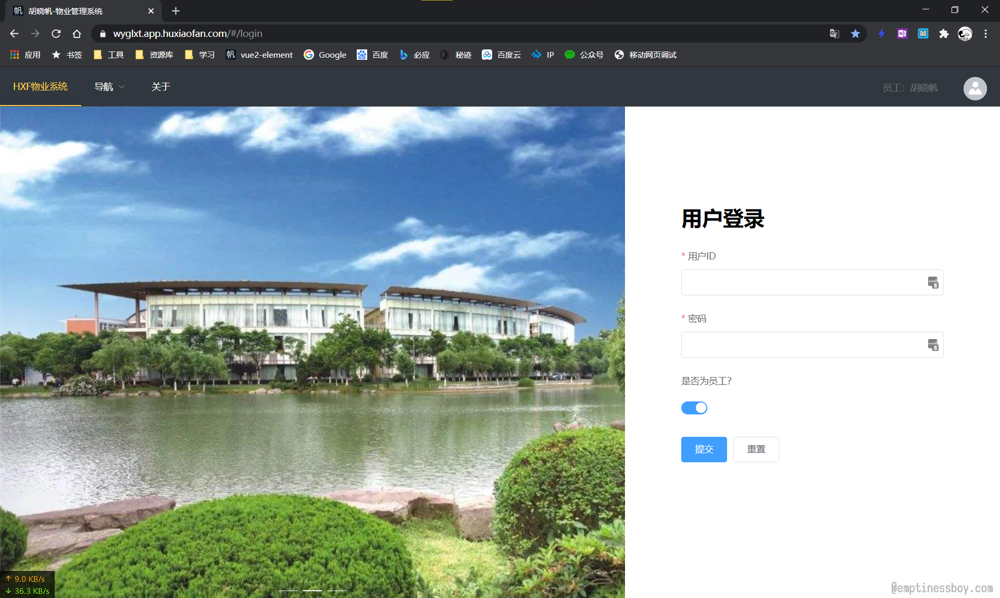
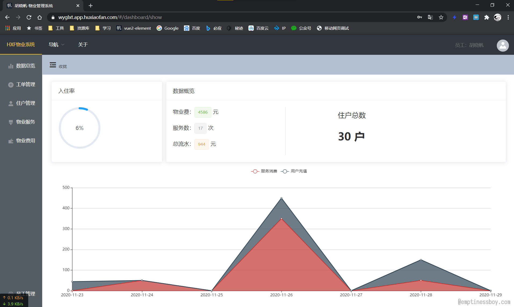
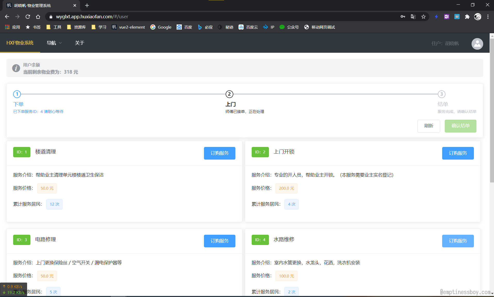
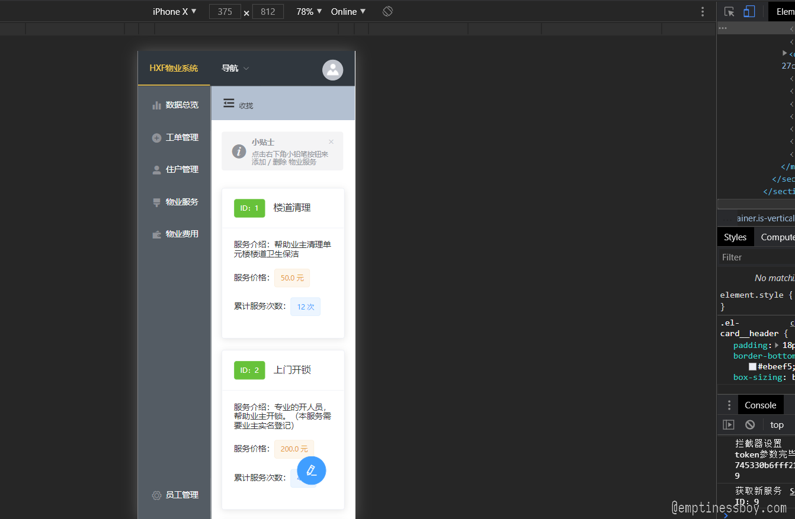
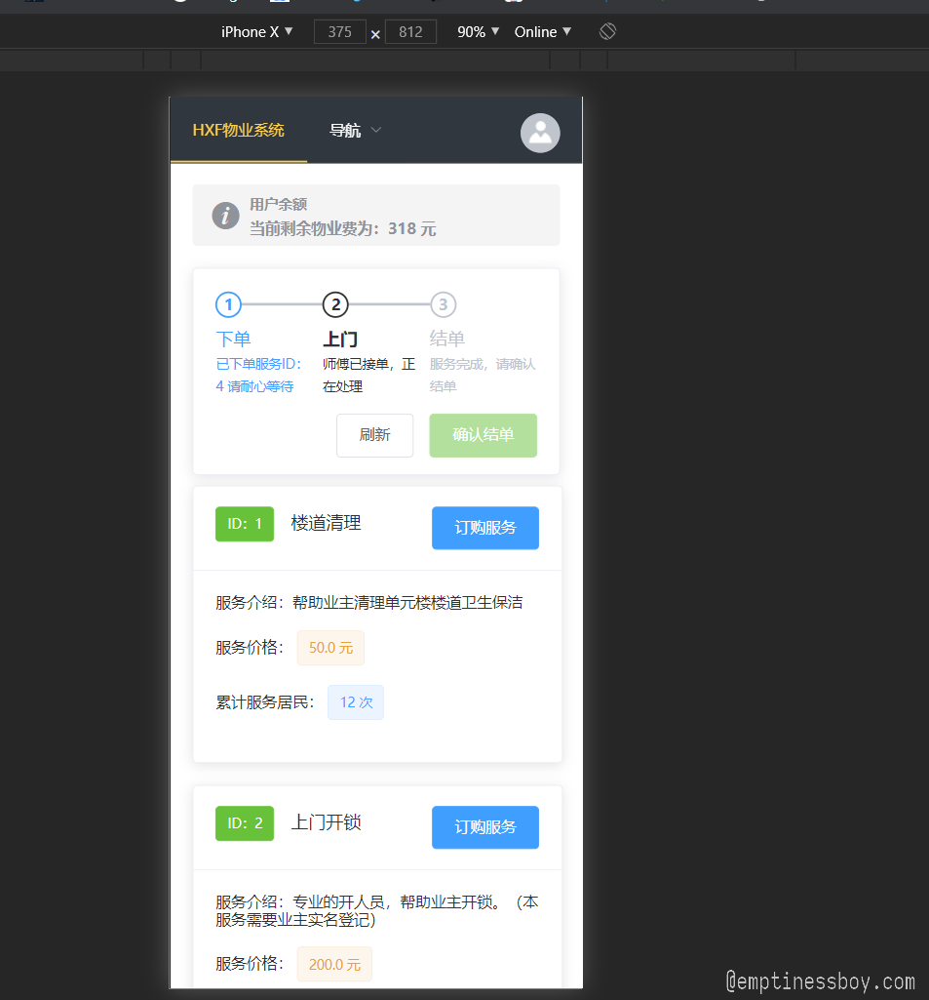

# VUE-物业管理系统前端

该项目主要是我本学期数据库课程的命题大作业。这里的代码是前端的实现部分。

## 特点

该项目使用了响应式设计，采用了完全的前后端分离。

前端使用了vue+element，后端使用Java语言写的Servlet，数据库使用的MySQL8。实现了用户记住登录，区分管理员和普通用户登录，权限管理，物业服务管理，在线结算等功能。


### 技术栈

前端部分：VUE.js + Element UI + VUEX(配合localstorage) + Router + axios(配合qs) + Echarts.js

======

### 源代码初始化
```
npm install
```

### 打包发布
```
npm run build
```

## 预览图

### PC 端效果

PC 端登录：



PC 端管理员DashBoard：



PC 端用户前台：



### 移动端效果

移动端管理员页面：



移动端普通用户页面：

](https://up.media.ever

