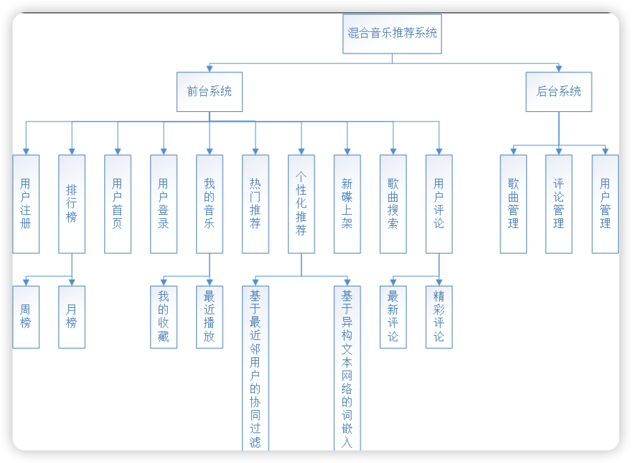
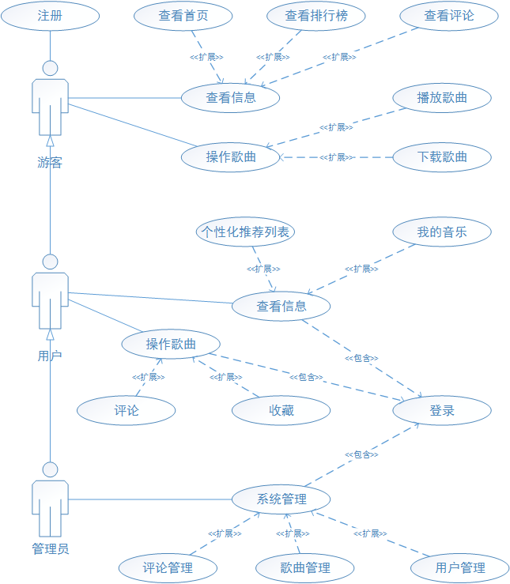
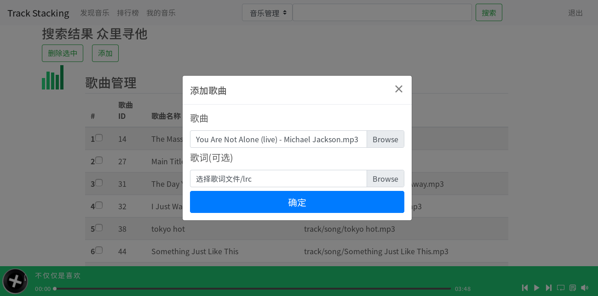
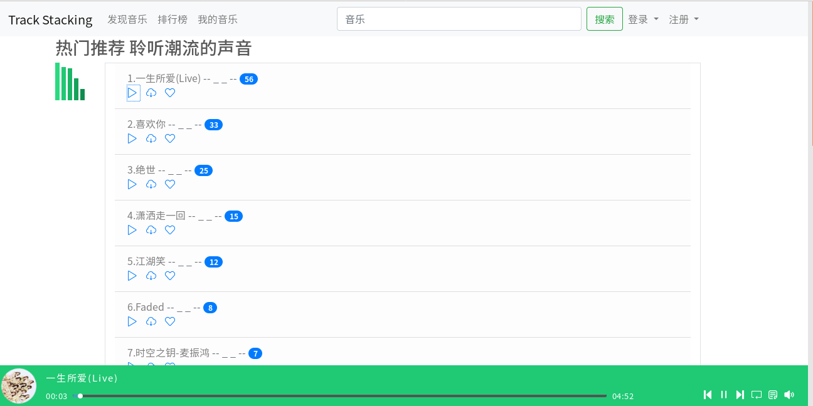
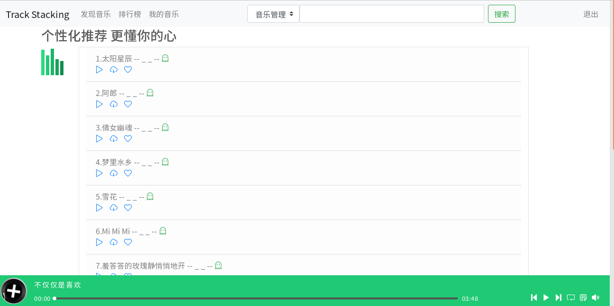

混合音乐推荐系统——Track Stacking——毕业设计

> 本系统主要通过隐式地收集用户对歌曲的播放，下载以及收藏行为记录，进而使用基于最近邻用户的协同过滤推荐算法为当前激活用户推荐歌曲; 对于有歌词信息的歌曲(英文)，通过基于异构文本网络的词嵌入来计算歌曲之间的相似性，进而根据用户的历史记录为其推荐相似的歌曲。

开发环境及框架:Ubuntu16,Eclipse,MySQL5.7,JDK1.8,Tomcat7.0,SSM,Maven,Git

其中，功能模块图如下:

系统角色用例图如下:

一些界面如下:

