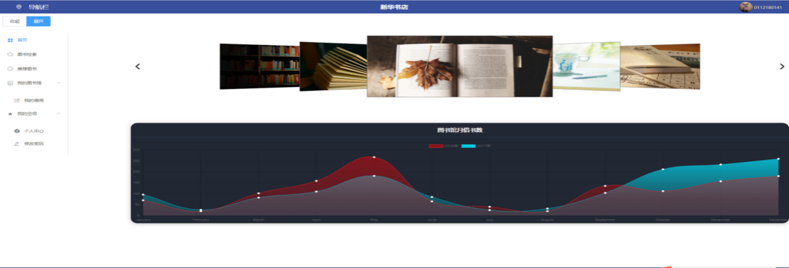
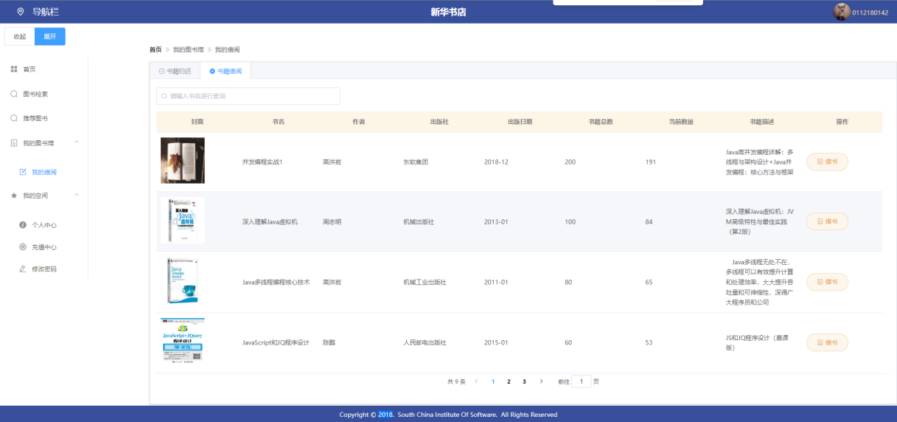

# VUE Express MySQL 图书管理系统

## 前期准备
 - node版本 11.15
 - 数据库 5.7.26																			
 

## 运行方式:

### 1.下载MySQL,先去把SQL文件导入到数据库中
### 2.cd 到 front目录下，然后执行 yarn dev 
### 3.cd 到backed yarn start 

### 系统实现

#### 页面导航主要概览

#### 用户系统功能主要模块(已实现)
- **登录、注册页面**
- **首页**
- **图书检索**
- **图书推荐**
- **图书借阅**
- **我的空间**

#### 管理员系统功能主要模块(已实现)
- **管理员首页**
- **借阅排行**
- **记录剩余天数并提示**
- **图书搜索**
- **借阅排行**
- **用户修改密码**
- **修改个人信息**
- **验证码**
- **图书录入、更新和删除功能代码**
- **学生个人信息查询、修改、删除和余额操作代码**
- **图书的查询和推荐**

# 效果图
### 首页

### 普通用户 - 借阅功能

### 普通用户 - 图书推荐

### 登录

### 注册

### 图书检索

### .....
数据库报错:

### this is incompatible with sql_mode=only_full_group_by

### 在 mysql.ini文件 的[mysqld] 下加上  
### sql_mode=STRICT_TRANS_TABLES,NO_ZERO_IN_DATE,NO_ZERO_DATE,ERROR_FOR_DIVISION_BY_ZERO,NO_ENGINE_SUBSTITUTION