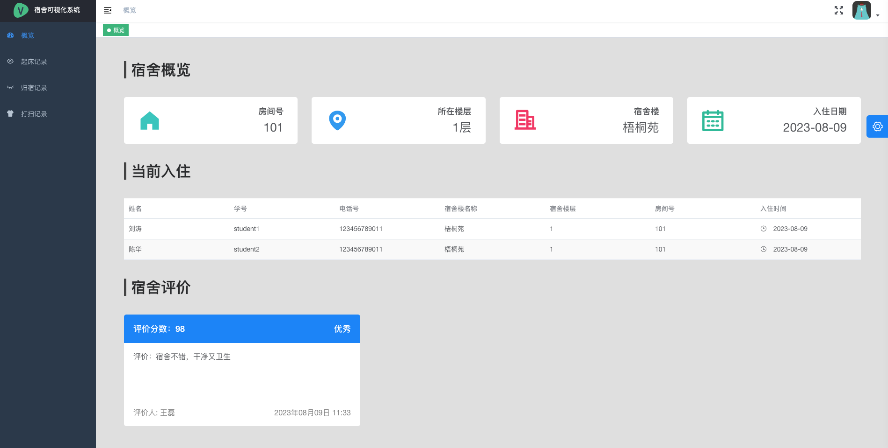
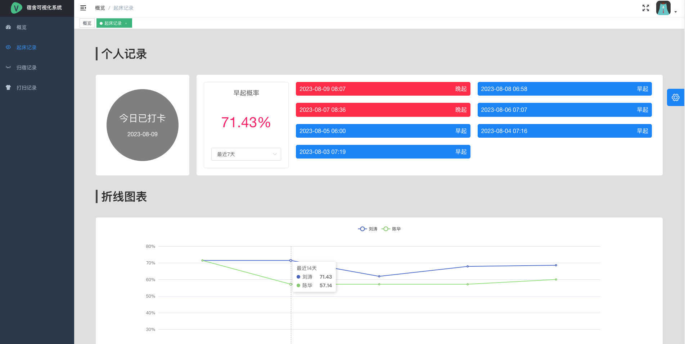
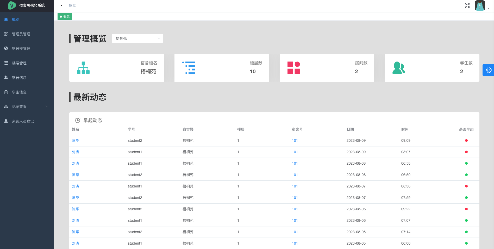
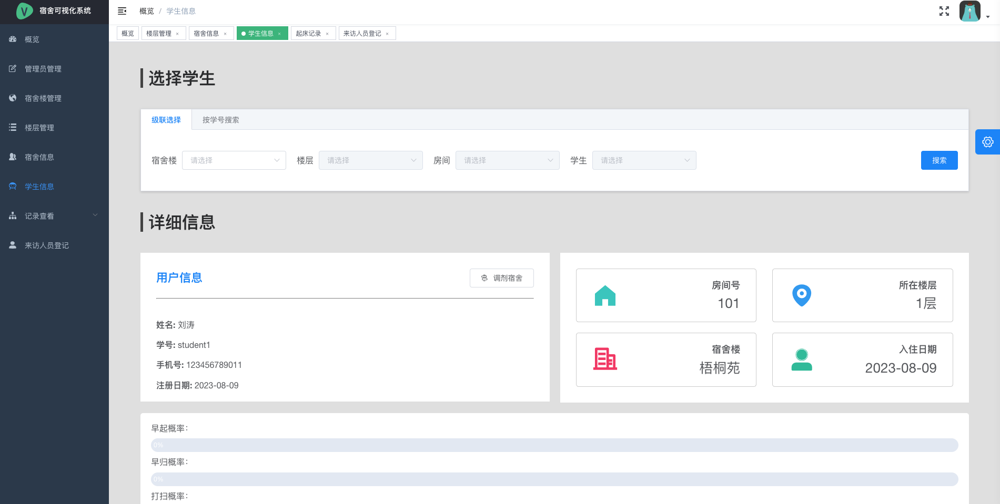
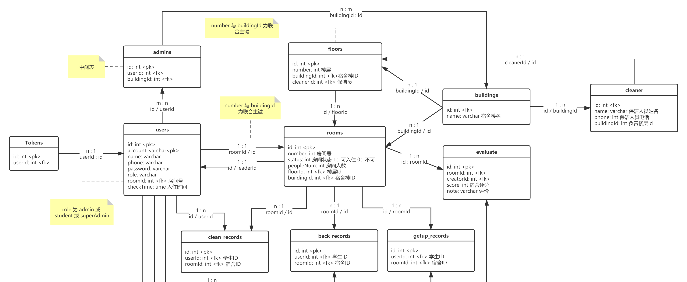
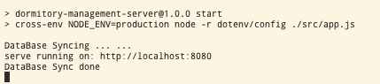

> 拯救了你的毕设或者大作业

# 0. 概览

基于 Koa 以及 VueJS 的宿舍管理系统。









## 更新记录：


主要需求：

- 学生信息录入、修改、删除、查询
- 宿舍管理评分
- 学生早起率、懒床率
- 学生宿舍打扫频率
- 学生晚归情况
- 楼层管理

考虑到实用性，该系统需要拆分为两大子系统，一个是学生端系统，一个是后台管理端系统。学生端系统主要提供给学生使用，负责一些宿舍记录及个人信息记录的基本操作；后台管理模块则是主要负责对所有学生信息的整理，提供宿舍管理、楼层管理、数据查看等权限，提供给宿舍管理员使用的。

## 1.1 学生系统

学生系统拥有以下功能：

- 创建账户
- 分配宿舍
- 填写个人信息
- 修改个人信息
- 起床打卡（用于统计懒床率）
- 归宿登记（用于统计晚归情况）
- 打扫记录（用于统计宿舍打扫频率）
- 查看宿日常数据

## 1.2 管理系统

管理系统拥有以下功能：

- 楼层管理
- 宿舍评价
- 宿舍信息管理
- 学生信息查看
- 保洁人员管理
- 统计学生早起率
- 统计学生宿舍打扫频率
- 统计学生晚归

超级管理员在享有上述管理员同等权限的同时额外拥有如下功能：

- 创建管理员
- 创建宿舍楼
- 为宿舍楼分配管理员
- 为宿舍楼分配保洁人员

# 3. 技术分析

前端：

- Vue 作为基础框架
- vue-router 控制路由（hash 模式）
- vuex 状态管理
- axios 接入数据
- [Vue-element-admin](https://github.com/PanJiaChen/vue-element-admin) 作为基础框架

后台（Nodejs）：

- Koa 作为基础框架
- koa-router —— 服务端路由控制
- koa-static —— 读取静态文件
- koa-jwt —— JWT 登录校验
- koa-body —— http body 数据处理
- koa-compress —— Gzip 压缩
- koa-cors —— CORS 解决跨域问题
- sequelize —— ORM

数据库：

- MySQL

数据库设计一览：




# 4. 项目启用方式

预先准备 Node 环境，**避免各种奇怪的问题，建议使用 16.x 版本**，

## 5.1 运行后台


```js
## 安装依赖
$ npm install

## 初始化数据库 
请私聊拿sql脚本 QQ:1442243445 获取

## 运行项目
$ npm run start
```

看到以下输出，即为成功：



浏览器访问 `http://localhost:8080`

预置账号：

- 管理员（admin 123456）
- 超级管理员（superAdmin 123456）
- 学生用户1（student1 123456）
- 学生用户2（student2 123456）


## 5.2 前端文件

按照上述步骤已经可以正常运行项目，如果需要修改与调试前端页面请按照以下步骤：

> 首先要确保已经在 `/clinet` 目录下运行过 `npm install` 安装好了前端依赖

1. 在 `/server` 目录下运行 `npm run dev` 开启后台开发模式
2. 在 `/client` 目录下运行 `npm run dev` 开启前端开发模式
3. 修改 `/clinet` 目录下的任意文件
4. 修改完成后，在 `/client` 目录下运行 `npm run build:prod`

> 构建时会出现警告，如 `$weight: Passing a number without unit % (0) is deprecated.` 无视即可，不影响功能


